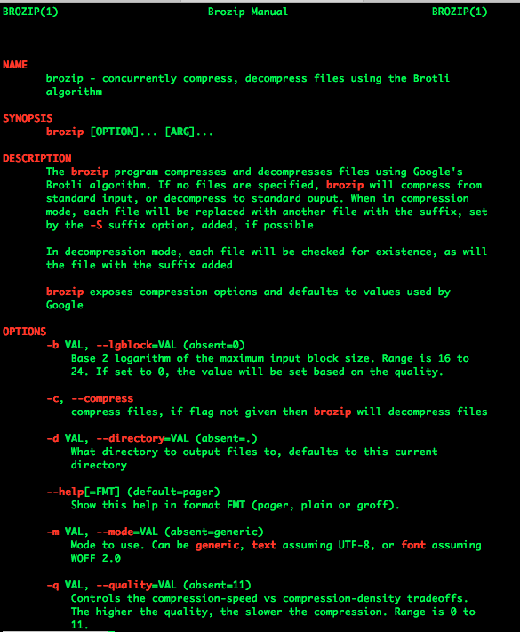

`brozip` is a **fast** command line tool to concurrently compress,
decompress files using the Brotli compression algorithm. If can handle
arbitrary number of files given and if none are given it will perform
an operation on `stdin` and push the results to `stdout`

# brozip usage

Look at the man page, always accessible with `brozip --help`

# Issues

As always, please report bugs and PRs are always welcome.

1.  Even though this is only 200 lines of Code, there are still places
    that can be refactored and made more `DRY`
2.  I'm leaving this for someone eager to get into open-source or
    `OCaml`
